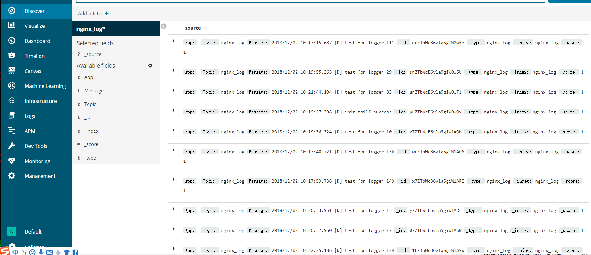

### collect log

CollectLog 是一个实时收集日志的并发送到kafka集群的客户端。

    1 支持日志路径配置
    2 支持多个日志实时收集
    3 依赖etcd, 支持动态配置收集日志

业界日志收集方案ELK
- elk方案问题
    1. 运维成本高，每增加一个日志收集，都需要手动修改配置
    2. 监控缺失，无法准确获取logstash的状态
    3. 无法做定制化开发以及维护
    
### 使用说明 

- log_transfer为日志收集客户端
- logagent为日志收集服务端
- web_admin为日志动态配置管理

log_transfer项目下的入口文件为main.go文件

logagent项目下的入口文件为main/main.go文件

web_admin项目下的入口文件为main/main.go文件

### 当前环境使用
go 1.11.2
etcd v3.3.10
elasticsearch 6.5.1
kibana 6.5.0
kafka 2.12-0.11.0.0
redis 5.0.2

所依赖第三方开源库
 
 ```code
 go get -v github.com/astaxie/beego
 go get -v github.com/Shopify/sarama
 go get -v github.com/olivere/elastic
 go get -v github.com/hpcloud/tail
 go get -v github.com/coreos/etcd/clientv3
 ```
 
### kibana收集示例效果

 
 
